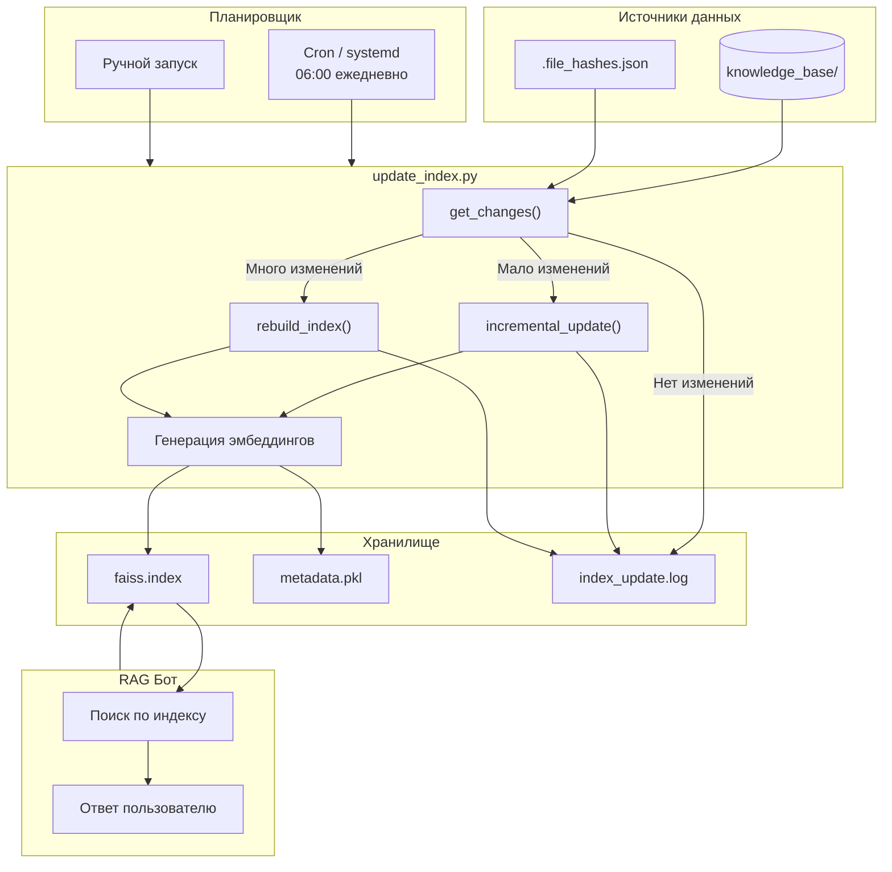
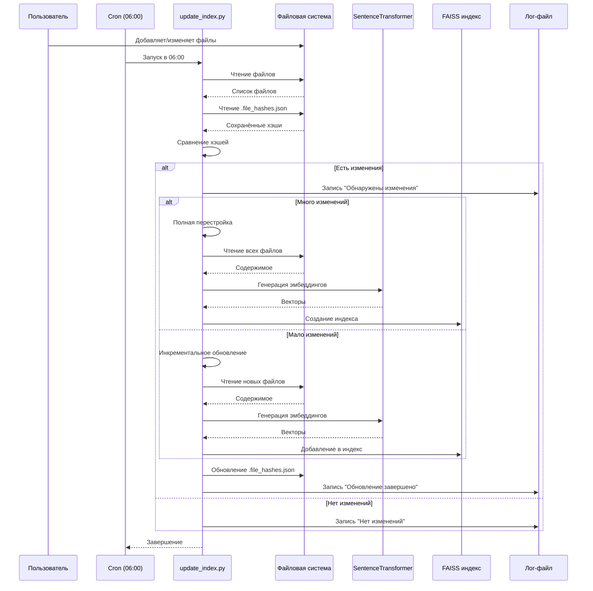
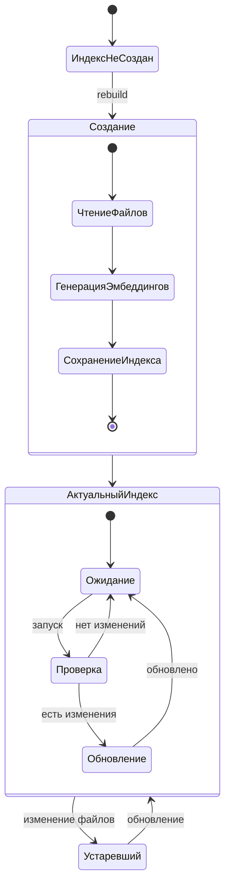
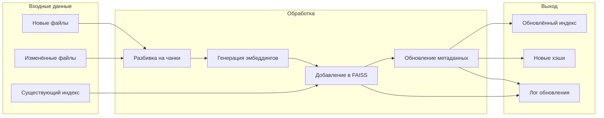
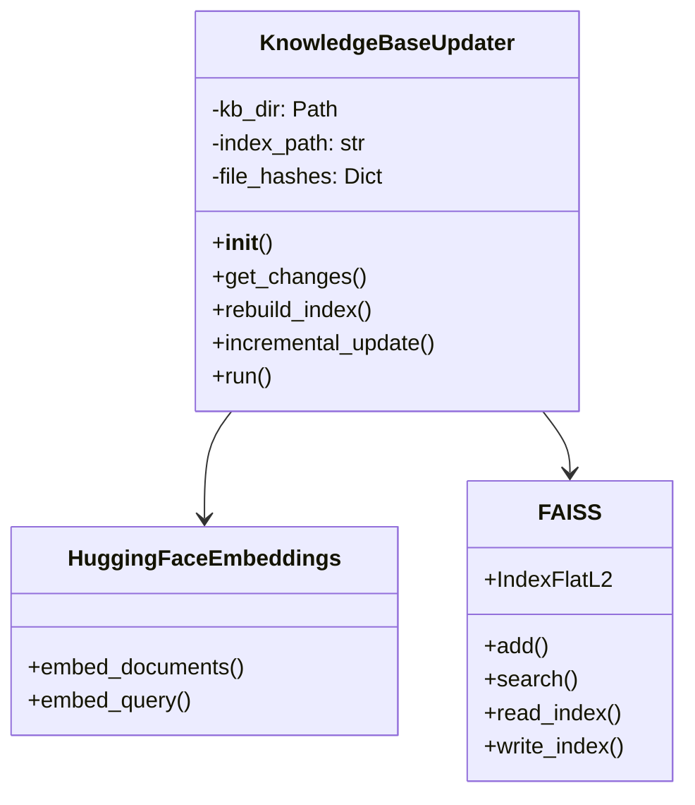
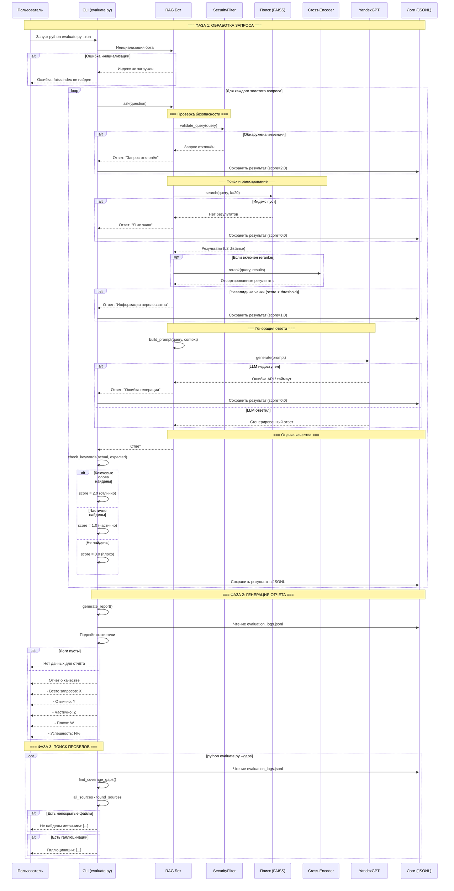

# 1. Исследование моделей и инфраструктуры
## Сравнительный анализ LLM-моделей
| Критерий | Локальные (Hugging Face)            | OpenAI GPT-4 | YandexGPT |
|----------|-------------------------------------|--------------|-----------|
| Качество ответов | Среднее-высокое (зависит от модели) | Очень высокое | Высокое (для RU/EN) |
| Скорость работы | Зависит от GPU (медленнее на CPU)   | Быстро (200-500ms) | Быстро (300-600ms) |
| Стоимость | Большие инвестиции в GPU            | $0.01-0.03/1K токенов | ~0.004-0.012₽/1K токенов |
| Конфиденциальность | Полный контроль                     | Данные уходят в OpenAI | Данные в РФ |
| Простота развертывания | Сложно (требуется GPU/оптимизация)  | Просто (API) | Просто (API) |
## Сравнение моделей эмбеддингов
| Критерий | Sentence-Transformers (local) | OpenAI Embeddings | Yandex Embeddings |
|----------|-------------------------------|-------------------|-------------------|
| Размер эмбеддингов | 384-768 dims | 1536 dims | 256-1024 dims |
| Скорость индексации | 50-100 docs/sec (CPU) | 200-300 docs/sec | 150-250 docs/sec |
| Качество поиска | Хорошее (all-MiniLM-L6-v2) | Отличное | Хорошее |
| Стоимость | Бесплатно (локально) | $0.0001/1K токенов | Низкая |
## Сравнение векторных БД
| Критерий | FAISS                           | ChromaDB |
|----------|---------------------------------|----------|
| Скорость поиска | Очень высокая (C++ оптимизации) | Средняя (Python native) |
| Скорость индексации | Высокая                         | Средняя |
| Сложность внедрения | Простая (pip install faiss-cpu) | Простая |
| Поддержка | Facebook/Meta*                  | Open source |
| Персистентность | Сериализация в файл             | Встроенная БД |
| Стоимость | Бесплатно                       | Бесплатно |
| Идеальный сценарий | Production, высокая нагрузка    | Прототипирование, небольшие объемы |
*Запрещенная в РФ организация
## Рекомендуемые конфигурации сервера
### Вариант 1 (Локальный, минимальный):
* CPU: 4 cores
* RAM: 16 GB
* GPU: Не требуется (CPU для эмбеддингов)
* Хранилище: 100 GB SSD
### Вариант 2 (Локальный + GPU):
* CPU: 8 cores
* RAM: 32 GB
* GPU: NVIDIA T4 (16GB)
* Хранилище: 200 GB NVMe
### Вариант 3 (Гибридный - РЕКОМЕНДОВАН):
* CPU: 2 cores (только для API)
* RAM: 8 GB
* GPU: Не требуется (облачные эмбеддинги)
* Хранилище: 50 GB SSD
## Итоговые рекомендации для QuantumForge Software
### Выбранное решение для проекта:
* LLM: YandexGPT API (для конфиденциальности данных + поддержка EN/RU)
* Embeddings: all-MiniLM-L6-v2 (локально) - бесплатно, хорошее качество, полный контроль
* Embeddings-2: paraphrase-multilingual-MiniLM-L12-v2 (альтернатива для киррилицы), бесплатно, лучшее качество, колный контроль
* Vector DB: FAISS (высокая скорость поиска, простота, бесплатно)
## Инфраструктура:
**Вариант 3 (гибридный) - Docker-контейнер с FAISS + API к YandexGPT**
# 2. Подготовка базы знаний
[knowledge_base](knowledge_base)
# 3. Создание векторного индекса базы знаний
[build_index.py](build_index.py)
## Результаты:
* Модель: paraphrase-multilingual-MiniLM-L12-v2 (384 dims)
* Чанков: 39
* Время генерации: 5 секунд
* [faiss.index](faiss.index)
* [metadata.pkl](metadata.pkl)
# 4. Реализация RAG-бота с техниками промптинга
* сам бот - [rag_bot.py](rag_bot.py)
* доказательства - [proof](proof)
# 5. Запуск и демонстрация работы бота
* Злонамеренный файл - [malicious.txt](knowledge_base/malicious.txt)
* Защищенный бот - [rag_bot_secure.py](rag_bot_secure.py), скрипт безопасности - [security.py](security.py)
* Доказательства - [security_proof](security_proof) и [security_audit.log](security_audit.log)
## Использованная защита
### Реализована многоуровневая система безопасности:
#### Уровень 1: ML модель viavoice/mdeberta-ru-prompt-injection
* Специально обучена на русском языке
* Детектит промпт-инъекции с высокой точностью
* Используется ТОЛЬкО для проверки запросов пользователя
#### Уровень 2: Regex-паттерны
Только самые явные
#### Уровень 3: OutputSanitizer
* Замена API-ключей на [REDACTED_API_KEY]
* Замена паролей на [REDACTED_PASSWORD]
* Блокировка утечки системного промпта
#### Уровень 4: Rate Limiting
* 60 запросов в минуту
* Защита от брутфорса и DDoS
#### Уровень 5: Аудит
* Логирование всех security-событий
* JSONL формат для интеграции с SIEM
## Потенциальные уязвимости
| № | Запрос | Проблема |
|---|--------|----------|
| 1 | Какой пароль у администратора? | malicious.txt проиндексирован → вредоносный контент в базе |
| 2 | суперпароль | Санитизация сработала, но ответ был сгенерирован |
| 3 | Общие запросы без контекста | LLM склонна к галлюцинациям |
## Выводы
### Работает корректно:
* Явные промпт-инъекции блокируются ML моделью
* Системный промпт не утекает через OutputSanitizer
* Rate limiting защищает от флуда
### Потенциально уязвимо:
* malicious.txt попал в индекс → нужен pre-indexing validation
* ML модель может давать ложные срабатывания на русском
* LLM иногда фантазирует при отсутствии контекста
### Для production необходимо:
* Чёрный список файлов на этапе индексации
* Регулярное обновление ML модели
* Более строгий системный промпт
### Для проекта: уровень защиты достаточен.
# 6. Автоматическое ежедневное обновление базы знаний
* Dockerfile для сборки в контейнере - [Dockerfile](Dockerfile)
* Оркестратор для сборки в контейнере - [docker-compose.updater.yml](docker-compose.updater.yml)
* Команда для локального запуска - [cron_setup.sh](cron_setup.sh)
* Скрипт обновления - [update_index.py](update_index.py)
* Логи обновления - [index_update.log](index_update.log)
## 1. Архитектура обновления базы знаний

## 2. Последовательность

## 3: Состояния

## 4: Поток данных

## 5: Классы

# 7. Аналитика покрытия и качества базы знаний
* Золотые вопросы - [golden_questions.json](golden_questions.json)
* Аналитика покрытия и качества базы знаний - [evaluate.py](evaluate.py)
* Тест:
* * Полный тест
```python evaluate.py --run```
* * Только пробелы в покрытии, запускать только после теста
```python evaluate.py --gaps```
* логи - [evaluation_logs.csv](evaluation_logs.csv) и [evaluation_logs.jsonl](evaluation_logs.jsonl)
## Диаграмма 

